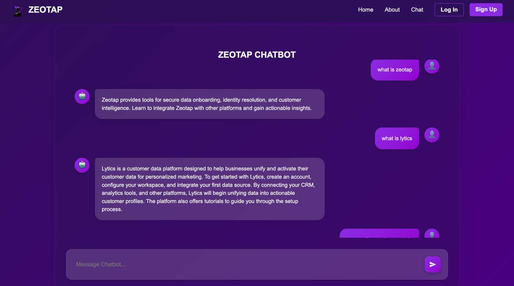

# Assignment 2: Building a Support Agent Chatbot for CDP

## Objective:
Develop a chatbot capable of answering "how-to" questions related to four Customer Data Platforms (CDPs): **Segment**, **mParticle**, **Lytics**, and **Zeotap**. The chatbot extracts relevant information from the official documentation of these platforms to provide users with step-by-step guidance.

---
## Links

- **Project Link**: [https://zeobot.onrender.com](#) 
- **Live Demo**: [ZeoSheets Demo](#) 

---

## Core Functionalities:
1. **Answer "How-to" Questions:**
   - Understand and respond to user questions about specific tasks or features within the CDPs.
   - Example questions include:
     - "How do I set up a new source in Segment?"
     - "How can I create a user profile in mParticle?"
     - "How do I build an audience segment in Lytics?"
     - "How can I integrate my data with Zeotap?"

2. **Extract Information from Documentation:**
   - Retrieve relevant information from the provided documentation URLs.
   - Navigate through documentation pages to identify sections containing the required details.

3. **Handle Variations in Questions:**
   - Process questions with different phrasing while maintaining accuracy.
   - Identify irrelevant queries, e.g., "Which movie is getting released this week?"

---

## Bonus Features:
1. **Cross-CDP Comparisons:**
   - Compare functionalities or processes between the four CDPs.
   - Example question: "How does Segment's audience creation process compare to Lytics'?"

2. **Advanced "How-to" Questions:**
   - Handle complex or platform-specific queries such as advanced configurations or integrations.

---

## Data Sources:
- **Segment Documentation:** [https://segment.com/docs/?ref=nav](https://segment.com/docs/?ref=nav)
- **mParticle Documentation:** [https://docs.mparticle.com/](https://docs.mparticle.com/)
- **Lytics Documentation:** [https://docs.lytics.com/](https://docs.lytics.com/)
- **Zeotap Documentation:** [https://docs.zeotap.com/home/en-us/](https://docs.zeotap.com/home/en-us/)

---

## Core Implementation Steps:
1. **Web Scraping:**
   - Scrape the documentation from each platform using `requests` and `BeautifulSoup`.
   - Extract relevant content, including titles, paragraphs, and links.

2. **Semantic Search:**
   - Use the `SentenceTransformer` model for embedding queries and documents.
   - Perform cosine similarity to find the most relevant document section for the query.

3. **Search Functionality:**
   - Process user queries to match with the most relevant content.
   - Return detailed responses including the title, source, URL, and extracted content.

4. **Web Application:**
   - Build a web interface using Flask with routes for home, query processing, login, and signup.
   - Serve responses via a user-friendly interface.

---
## Application UI

Below is the home page of the chatbot application:

Below is the Login page of the chatbot application:

Examples of a chatbot query response:

---

## Contributing

Contributions are welcome! Please follow these steps:
1. Fork the repository.
2. Create a new branch (`git checkout -b feature/your-feature-name`).
3. Commit your changes (`git commit -m 'Add some feature'`).
4. Push to the branch (`git push origin feature/your-feature-name`).
5. Open a pull request.

---

## Author
Developed by **Prashanth G**. For inquiries, please reach out to prashanth.dev1908@gmail.com.
